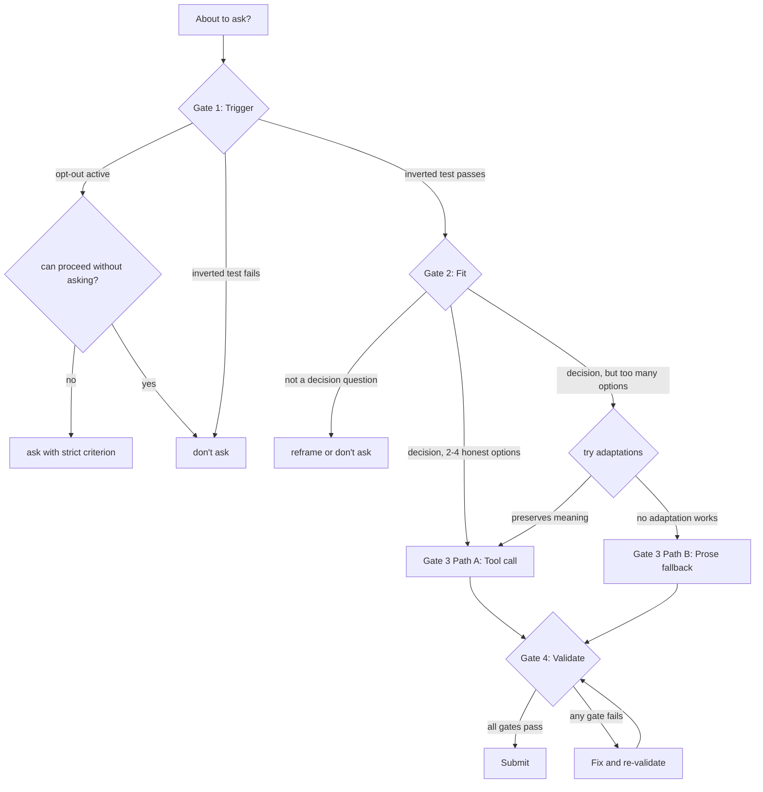

# Ask Questions

This skill governs how the LLM uses the `ask_question` tool (and equivalent discrete-choice clarification tools) to interact with the user. It addresses two failure modes:

1. **Mis-appropriation** — using the tool for open-ended or exploratory questions the tool cannot answer.
2. **Under-trigger** — having the tool but not using it unless explicitly prompted.

Both failures stem from a single broken decision procedure. This skill replaces that procedure with a four-gate linear workflow.

## When to Use

- The LLM is about to call the `ask_question` (or equivalent) tool.
- The LLM is considering whether to ask the user a question and is unsure whether to ask, how many to ask, or how to shape them.
- The LLM has a real question whose answer would change its next action and that cannot be resolved from context, code, or safe inference.

## When Not to Use

- For rhetorical questions (the LLM is making a point, not soliciting input).
- When the user has explicitly opted out of being asked.
- When the LLM can resolve the question from context, code, or safe inference.
- For trivial confirmations better handled by proceeding and showing the work.

## Core Concepts

| Term | Meaning |
|---|---|
| `ask_question` | The abstract discrete-choice clarification tool affordance. In opencode, the `question` tool. |
| `label` | The option's short scannable title. |
| `description` | The option's short discriminative explanation, shown beneath the label. |
| `context prose` | The LLM's message text *before* the tool call, carrying the longer setup. |
| `decision surface` | The tool call itself, the discrete-choice UI. |
| `call` | A single invocation of the `ask_question` tool. |
| `trigger` | The Gate 1 test: is this a real question worth asking? |
| `fit test` | The Gate 2 test: does this question fit the tool? |
| `gate` | A hard checkpoint in the workflow; if it fails, the LLM does not proceed. |
| `prose fallback` | A last-resort prose question in message text, used when the option set genuinely cannot fit the tool. |

## Mode Detection

The LLM operates in one of three modes, detected from the user's current and recent messages.

### Invited mode
The user has explicitly licensed questioning. Trigger the batching escape (2-3 questions per call). Phrasings include:
- "grill me"
- "ask me anything"
- "ask me everything"
- "what do you need to know?"
- "what would you ask me?"

### Opt-out mode
The user has explicitly declined being asked. Fall back from the inverted trigger to a strict criterion (ask only if the LLM cannot proceed without it). Phrasings include:
- "just do it"
- "use your judgment"
- "don't ask"
- "figure it out"
- "stop asking"

### Neutral mode (default)
Neither invited nor opted-out. Apply the inverted trigger without the batching escape.

### Extension clause
If a phrase carries the spirit of an invitation or opt-out (e.g., "what would you ask me?" implies invitation), apply the corresponding mode even if not on the list. Extension is by analogy, not by free interpretation. The signal must be about *this conversation*: "I have questions about X" is not an invitation — the user is planning to ask *you*.

## Workflow



Each gate is a hard checkpoint: if it fails, the LLM does not proceed to the next gate.

### Gate 1: Trigger

Apply the **inverted trigger**: ask when there is a real question whose answer would change the LLM's next action AND that the LLM cannot resolve from context, code, or safe inference.

- If the LLM finds itself writing "I can probably infer X," that is not resolution — ask.
- If **opt-out mode** is active, fall back to: ask only when the LLM cannot proceed at all without the answer.
- If **neutral mode** and the inverted test fails, do not ask.
- If the trigger passes, proceed to Gate 2.

### Gate 2: Fit

Apply the fit test. Two sub-checks:

**Sub-check A — Decision test:** Is this a decision question (a discrete choice between realistic alternatives) or an honestly bracketed continuum?

- If no → reframe as a decision question, or do not ask.
- If yes → proceed to sub-check B.

**Sub-check B — Adaptability test:** Can the question be honestly consolidated into 2-4 options?

Before falling back to prose, the LLM must try these adaptations, in any combination:

- **Raise abstraction:** consolidate by raising the level of abstraction. E.g., "Which of these 6 logging libraries?" → "Heavy framework or lightweight?" (2 options subsume the 6).
- **Sequence:** break a branched decision into multiple independent tool questions, each with 2-4 options.
- **Subsume:** reframe a long option list as a more abstract single decision.
- **Consolidate:** merge adjacent options.

If any adaptation works **without losing essential information** → proceed to Gate 3 (Path A: tool call).

If all adaptations lose essential meaning → proceed to Gate 3 (Path B: prose fallback).

### Gate 3: Construct

Two paths from Gate 2.

#### Path A: Tool call

1. **Write context prose first.** The prose sets up the decision. It exists to make the choice legible, not to teach the topic. *Test:* if the user can pick correctly without reading the prose, the prose is too long.
2. **Construct the tool call:**
   - **1 question per call by default.** Batch 2-3 questions only if both (a) demonstrably independent and (b) the user is in invited mode.
   - **2-4 options per question.** Each option must be a real stance, not a forced binning.
   - **Alphabetical order.** The marker is the signal; position is for predictability.
   - **Mark the recommended option** (if the LLM has one) with `(Recommended)`. The recommendation is what the LLM would commit to on the user's behalf given the user's stated context — not the LLM's preferred architecture, not the most common choice.
   - **Labels:** ≤6 words, parallel grammatical form (e.g., all noun phrases or all verb phrases).
   - **Descriptions:** ≤80 characters, discriminative only. *Test:* each description must answer "why pick this over the others?" If the description teaches rather than discriminates, move it to context prose.
   - **Headers:** ≤30 characters, scannable, in domain language.
3. **Verify independence** for any batched questions. *Test:* if Q2's options would plausibly change based on Q1's answer, Q2 is dependent — fold it into Q1 or sequence it for a later call.

#### Path B: Prose fallback

Use only when Gate 2 sub-check B fails. Construct the prose question in the LLM's message:

1. **1 question at a time** (the doctrine applies here too).
2. **Options as a numbered or bulleted list.**
3. **Prose discipline:** the prose must be necessary to make the choice. *Test:* if the user can pick correctly without reading the prose, the prose is too long.
4. The LLM may indicate a recommendation in the prose ("I'd suggest B because..."), but not via a UI marker (prose questions don't have one).

### Gate 4: Validate

Before submitting, run the mechanical checks listed in the [Validation](#validation) section. If any check fails, fix and re-validate. Do not submit a failing draft.

## Examples

Six worked examples: five cover the key failure modes, one (Example F) demonstrates the recommendation pattern specifically.

### Example A: Should-ask

**Context:** the LLM is helping a user scaffold a new project. The choice of dependency injection library affects every file.

- **Trigger:** the answer would change the LLM's next action (which DI library to install and configure); the LLM cannot infer the user's preference from context.
- **Fit:** decision question, 3 honest options.

**Context prose:**
```
You'll need a DI container. Three reasonable options:
- Autofac — featureful, supports advanced scenarios like assembly scanning
- Manual constructor injection — no library, just `new()` everywhere
- Microsoft.Extensions.DependencyInjection — built into ASP.NET Core, no extra dependency

Which fits?
```

**Tool call:** 1 question, 3 options, alphabetical, no recommendation (depends on context not in scope).

### Example B: Should-not-ask

**Context:** the LLM is implementing a function and the user wrote a comment "use sensible defaults."

- **Trigger:** the user has signaled "use your judgment" — opt-out mode. The LLM should proceed with sensible defaults without asking.
- **Action:** do not ask. Pick defaults, document them in the response, proceed.

### Example C: Mis-appropriation avoided

**Context:** the user says "tell me about your idea for a CI pipeline."

- **Trigger:** the user is asking the LLM to describe something, not asking the LLM to ask them a question.
- **Fit:** the question "what's your idea?" is exploratory, not a decision. The tool cannot answer it.
- **Action:** do not call `ask_question`. Respond in prose with the LLM's idea.

### Example D: Under-trigger recovered

**Context:** the user asks "should I add a retry policy to the HTTP client?" The LLM initially considered answering based on general best practices.

- **Trigger:** the user's *specific* context (is the API idempotent? how expensive are failed requests?) determines the right answer. The LLM cannot infer these.
- **Fit:** decision question, 3 honest options (no retries, exponential backoff, manual retry only).

**Context prose:**
```
The right answer depends on your context — is the API idempotent, and how expensive are failed requests?

Three honest options:
- Exponential backoff — assume transient failures, retry up to 3 times
- Manual retry only — let the caller decide per-request
- No retries — surface failures fast

Which fits your API?
```

**Tool call:** 1 question, 3 options, alphabetical, no recommendation (depends on the user's API).

### Example E: Batching escape

**Context:** the user has said "grill me — ask me everything you need to know to design this system." Invited mode.

- **Trigger and fit:** the LLM has 4 independent decisions to gather. Each is a decision question with 2-3 options. None depend on each other.

**Construct:** batch into a single tool call with 4 questions, e.g.:

- Q1: *Where will the system run?* — Cloud-hosted, On-premises, Hybrid
- Q2: *Who is the primary user?* — End users, Internal staff, External API consumers
- Q3: *What is the read/write ratio?* — Read-heavy, Write-heavy, Balanced
- Q4: *What is the consistency requirement?* — Strong, Eventual, Best-effort

The batching is justified because (a) the questions are demonstrably independent and (b) the user explicitly invited batching. If any question in the batch is dependent on another, fold or sequence it.

### Example F: Recommendation provided

**Context:** the user is starting a new web service and needs to choose a database. The LLM has a defensible default for most use cases: Postgres.

- **Trigger:** the answer would change the LLM's next action (which database client to install, which migrations framework to set up).
- **Fit:** decision question, 3 honest options.

**Context prose:**
```
For a new web service, the database choice locks in the persistence layer. For most use cases, Postgres is the right default — strong consistency, mature tooling, broad ecosystem support. Pick SQLite only for embedded/CLI tools; pick MongoDB only if you have a document-model use case that justifies the consistency tradeoffs.
```

**Tool call:** 1 question, 3 options, alphabetical, **with `(Recommended)` in the label of the Postgres option**:
- Label: `MongoDB`
- Label: `Postgres (Recommended)`
- Label: `SQLite`

The recommendation is justified in the prose-before ("for most use cases, Postgres is the right default") and is what the LLM would commit to on the user's behalf given the stated context (new web service). A user with a different use case can still pick MongoDB or SQLite with full information — the marker is a pointer, not a coercion.

## Validation

The final output (tool call + context prose, or prose fallback) must pass these mechanical gates. Each gate is independently verifiable.

- [ ] **Trigger Gate** — the inverted trigger passed; opt-out (if active) did not block; the LLM has a real question whose answer would change its next action.
- [ ] **Fit Gate** — the question is a decision (or honestly bracketed); adaptations were tried before prose fallback.
- [ ] **Count Gate** — 1-3 questions per call; 2-4 options per question; ≤80 character descriptions; ≤30 character headers.
- [ ] **Independence Gate** — any batched questions are demonstrably independent; if Q2's options would change based on Q1's answer, Q2 is dependent.
- [ ] **Order Gate** — alphabetical; `(Recommended)` marker on the LLM's pick (if any); recommendation is what the LLM would commit to on the user's behalf given the user's stated context.
- [ ] **Prose Discipline Gate** — context prose is necessary to make the choice (test: user can pick without it = too long); descriptions are discriminative (test: each answers "why pick this over the others?"); prose fallback (if used) is justified by failed adaptations.
- [ ] **Term Purity Gate** — vocabulary matches the core concepts; no implementation details leak into user-facing prose.

A failing gate means the LLM does not submit. Fix and re-validate.
